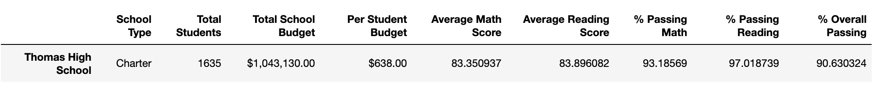
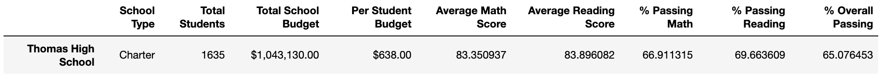

# Challenge 4, School District Analysis.

 <h2> Abstract 

The school board has notified that the ninth graders of Thomas High School appear to have altered the reading and math grades. 
They have given a dataset of 39,170 students from multiple high schools, in a csv file called students_complete.csv, which shows academic dishonesty form the previous mentioned ninth graders; 
furthermore, The school board does not know the full extent of the academic dishonesty. However, they want to uphold state-testing standards and have requested 
to replace the math and reading scores for Thomas High School with NaNs while keeping the rest of the data intact. This, with the purpose to 
write a new analysis of the schools districts and describe how these changes affected the overall analysis of the previous, original school district analysis, which has been given by the school board.
With the help of Pandas loc method and conditional statements, it was possible to retrieve the ninth grades of reading and math of the Thomas High School and replace them with NaNs. 
Following, the district summary was conducted, resulting in minimum changes from the original script.

 <h2> Changing the Reading And Math Grades To NaNs From Thomas High School. 

The Pandas loc method was used, with conditional statements and comparison and logical operators, in order to 
select the ninth-grade reading and math scores for Thomas High School and replace these grades with NaN by implementing NumPy.
As it can be seen in the image below, the information was not altered except the grades of the ninth graders of Thomas High School, that is to say, the remaining information is intact.

 <h3> New School District Analysis 

 The school district summary is based on several key metrics: Below these metrics are shown with their corresponding result.

* The district summary:
* The school summary
* The top 5 and bottom 5 performing schools, based on the overall passing rate
* The average math score for each grade level from each school
* The average reading score for each grade level from each school
* The scores by school spending per student, by school size, and by school type  

district summary

  

school summary

  

top 5 schools

  

bottom 5 schools

  

 
average math score  

 
average reading score  

 
school spending per student  

 
scores by size  

 
scores by type  

For this task,  the total student count is recalculated by subtracting the number of ninth-grade students in Thomas High School from the original total student count, which is in the original script and will be modified. 
Following, the passing math and passing reading percentages are recalculated as well as the overall passing percentage, with the modified total student count.

In Steps 5-14, you’ll execute the code from this module that creates and formats the School Summary DataFrame, then update the school summary using the 10th-12th graders from Thomas High School as follows:

First, you’ll calculate the number of 10th-12th graders in Thomas High School.
Create three new DataFrames for the 10th-12th graders from Thomas High School: students who passed math, students who passed reading, and students who passed both math and reading.
Using these DataFrames, you'll recalculate the percentage of students who passed math, passed reading, and passed both math and reading for Thomas High School only.
Finally, you'll replace the % Passing Math, % Passing Reading, and % Overall Passing scores in the current School Summary DataFrame with the new passing percentages for Thomas High School.

 <h3> Original District Analysis 
  

original district summary

  

original school summary

  

<h2> Results And Discussion 

: Comparing the new district analysis with the original district analysis

* How is the district summary affected?
    - as it can be seen, the district summary was not enormously changed, the results dropped very little. 
    - 
* How is the school summary affected?
  
* How does replacing the ninth graders’ math and reading scores affect Thomas High School’s performance relative to the other schools?
  
* How does replacing the ninth-grade scores affect the following:
  
    * Math and reading scores by grade
      
    * Scores by school spending
      
    * Scores by school size
      
    * Scores by school type

 <h2> Summary 

Summarize four changes in the updated school district analysis after reading and math scores for the ninth grade at Thomas High School have been replaced with NaNs

  
* That change with NaN also made possible for Thomas High School to make it into the Top 5 performing schools based on the overall passing.

* It also impacted in the bin results due to the change in the passing percentages.

* It helped to improve the school position, but it did not impact on some values since it was not the highest in some points, nor the lowest, except that Thomas High School would had been the lowest percentage in passing reading percentage.

* after changing the ninth grades of the Thomas High School, percentages dropped. However, this reduction was not very significant compared with the original result.
  
